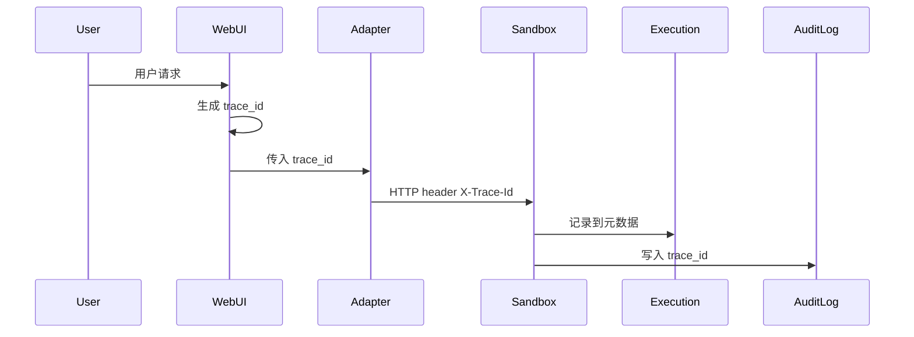

# Pi Enterprise Sandbox — Development Plan

> 基于 `pi_sandbox_final_design.md` 的设计方案和 `AUDIT.md` 的差距分析，输出后续开发计划。
> 版本：v1.0 · 2026-07-03
> ⚠️ **注意**: 本文档基于 v2 架构编写（引用 `webui/`、`webui/server.js` 等已废弃路径）。当前实现为 v4 三容器架构，详见 [README.md](README.md) 和 [docs/architecture.md](docs/architecture.md)。

---

## 目录

1. [Session 关联与持久化](#1-session-关联与持久化)
2. [Trace ID 贯穿链路](#2-trace-id-贯穿链路)
3. [外部持久化存储](#3-外部持久化存储)
4. [新增内置 Skill](#4-新增内置-skill)
5. [WebUI Tool 可视化 + 审批](#5-webui-tool-可视化--审批)
6. [Sandbox Dockerfile 预装依赖](#6-sandbox-dockerfile-预装依赖)

---

## 1. Session 关联与持久化

**状态：** ❌ 未开始
**优先级：** P0 — 基础架构

### 目标

Pi Agent session 与 Sandbox session 建立可持久化的双向映射，重启后对话可恢复、workspace 可重建关联。

### 现状

```
Pi Agent 内部 session（私有，ID 不对外暴露）
    │
    │  ❌ 无关联，agent_session_id 始终为 null
    ▼
Sandbox Session "sandbox_xxx"（纯内存）
    agent_session_id: null
```

### 要做

| # | 子任务 | 涉及文件 | 说明 |
|---|---|---|---|
| 1.1 | 确定 Session ID 方案 | 设计决策 | 三种选择：Pi 暴露 ID / WebUI 生成 enterprise ID 作为统一纽带 / Sandbox 生成后回传给 Pi 侧保存 |
| 1.2 | WebUI 传入 `agent_session_id` | `webui/server.js` | `POST /sessions` 时传入 Pi Agent 的可关联 ID |
| 1.3 | Extension 传入 `agent_session_id` | `agent/enterprise-sandbox-ext/index.ts` | `session_start` 回调中传入 Pi 的 session ID |
| 1.4 | Sandbox 侧持久化映射表 | `sandbox/services/session_manager.py` | `agent_session_id` ↔ `sandbox_session_id` 存入数据库（依赖 #3） |
| 1.5 | Pi Agent 对话历史持久化 | `webui/server.js` | 利用上游 JSONL 机制或统一数据库存储 messages |
| 1.6 | 重启恢复 | 综合 | 给定 enterprise session ID → 找回 Pi 对话 + Sandbox workspace |

### 验收标准

- 创建对话后，Sandbox 侧能查到 `agent_session_id` 不为空
- 重启 Sandbox 服务后，给定 `agent_session_id` 能找回对应的 `sandbox_session_id` 和 workspace 路径
- 重启 WebUI 后，对话列表和消息历史可恢复

---

## 2. Trace ID 贯穿链路

**状态：** ❌ 未开始
**优先级：** P1 — 可观测性

### 目标

在 Pi Agent → Adapter → Sandbox → Execution 的全链路中加入 `trace_id`，实现端到端追踪。

### 现状

- 没有任何 `trace_id` / `span_id` / `request_id`
- 审计日志没有关联键，无法串联一次用户请求的全链路

### 要做



| # | 子任务 | 涉及文件 | 说明 |
|---|---|---|---|
| 2.1 | WebUI 入口生成 trace_id | `webui/server.js` | 每个 chat 请求生成 UUID，传给 SandboxClient |
| 2.2 | SandboxClient 透传 header | `agent/sandbox_client.py` + `agent/enterprise-sandbox-ext/index.ts` | `X-Trace-Id` header |
| 2.3 | Sandbox Service 解析 header | `sandbox/main.py` middleware | 提取 trace_id，注入到 execution/audit |
| 2.4 | Audit 日志增加 trace_id | `sandbox/services/audit_logger.py` | 所有事件类型增加该字段 |
| 2.5 | Execution 元数据增加 trace_id | `sandbox/services/execution_manager.py` | 记录到 execution entry |
| 2.6 | 检索接口（可选） | 新增 route | `GET /traces/{trace_id}` 返回关联的全部事件 |

### 验收标准

- 一次用户请求在 audit log 中的多条记录共享同一个 `trace_id`
- 可以从 `trace_id` 查询到：调用了哪些 tool、执行了哪些命令、耗时、结果

---

## 3. 外部持久化存储

**状态：** ❌ 未开始
**优先级：** P0 — 基础架构

### 目标

Session、Execution、Artifact、Audit 四个实体从内存 dict 迁移到数据库，重启不丢、可检索。

### 现状

| 实体 | 当前存储 | 问题 |
|---|---|---|
| Session | `_sessions: dict` | 重启全丢，无法重建映射 |
| Execution | `_executions: dict` | 重启全丢 |
| Artifact | `_artifacts: dict` | 重启全丢，只有磁盘文件成孤儿 |
| Audit | Python logging → stdout | 容器日志 rotate 后不可查 |

### 要做

#### 3.1 选型

| 方案 | 优点 | 缺点 | 推荐场景 |
|---|---|---|---|
| **SQLite WAL** | 零依赖，简单，单机够用 | 写并发有限，不跨实例 | 单机部署 ✅ 一期推荐 |
| **PostgreSQL** | 高并发，跨实例，查询强 | 额外依赖，运维成本 | 多实例/高可用 |

#### 3.2 表结构

```sql
-- Session
CREATE TABLE sessions (
    session_id         TEXT PRIMARY KEY,
    agent_session_id   TEXT,
    enterprise_session_id TEXT,
    user_id            TEXT,
    caller_id          TEXT NOT NULL DEFAULT 'unknown',
    status             TEXT NOT NULL DEFAULT 'RUNNING',
    workspace_path     TEXT,
    metadata           TEXT,  -- JSON
    created_at         TEXT NOT NULL,
    updated_at         TEXT NOT NULL,
    ttl_until          TEXT
);

-- Execution
CREATE TABLE executions (
    execution_id    TEXT PRIMARY KEY,
    session_id      TEXT NOT NULL REFERENCES sessions(session_id),
    status          TEXT NOT NULL DEFAULT 'PENDING',
    run_type        TEXT,  -- python / command / node
    exit_code       INTEGER,
    duration_ms     REAL,
    truncated       INTEGER DEFAULT 0,
    trace_id        TEXT,  -- 关联 #2
    created_at      TEXT NOT NULL
);

-- Artifact
CREATE TABLE artifacts (
    artifact_id          TEXT PRIMARY KEY,
    session_id           TEXT NOT NULL REFERENCES sessions(session_id),
    name                 TEXT NOT NULL,
    path                 TEXT NOT NULL,
    mime_type            TEXT,
    size                 INTEGER DEFAULT 0,
    source_execution_id  TEXT REFERENCES executions(execution_id),
    created_at           TEXT NOT NULL
);

-- Audit Log
CREATE TABLE audit_logs (
    id           INTEGER PRIMARY KEY AUTOINCREMENT,
    event_type   TEXT NOT NULL,  -- tool_call / execution / session_lifecycle / error
    session_id   TEXT REFERENCES sessions(session_id),
    execution_id TEXT REFERENCES executions(execution_id),
    trace_id     TEXT,
    payload      TEXT NOT NULL,  -- JSON
    created_at   TEXT NOT NULL
);
```

#### 3.3 实施步骤

| # | 子任务 | 涉及文件 | 说明 |
|---|---|---|---|
| 3.1 | 初始化数据库连接 | `sandbox/config.py`, `sandbox/database.py`（新增） | 用 SQLite WAL + `pydantic-settings` |
| 3.2 | Repository 层 | `sandbox/repositories/`（新增） | 每个实体一个 repository class |
| 3.3 | 替换 SessionManager | `sandbox/services/session_manager.py` | 从 dict → repository |
| 3.4 | 替换 ExecutionManager | `sandbox/services/execution_manager.py` | 同上 |
| 3.5 | 替换 ArtifactManager | `sandbox/services/artifact_manager.py` | 同上 |
| 3.6 | 替换 AuditLogger | `sandbox/services/audit_logger.py` | 写入表同时保留 stdout log |
| 3.7 | 迁移旧数据（可选） | — | 一期不需要，全内存无旧数据 |

### 验收标准

- 启动 Sandbox 服务后自动建表
- 创建 session / execution / artifact 后，重启服务仍可查到
- Audit 记录可通过 SQL 检索

---

## 4. 新增内置 Skill

**状态：** ❌ 未开始
**优先级：** P1 — 功能增强

### 目标

新增常用内置 Skill，覆盖文档解析、数据分析、数据库操作等场景。从 GitHub 寻找成熟方案适配，不自研。

### 方式

- 以标准 `SKILL.md` 格式封装
- 依赖预装在 Sandbox 容器中（依赖 #6）
- Skill 目录放入 `skills/`，只读挂载

### 候选 Skill 清单

| 方向 | 候选项目/方案 | 说明 |
|---|---|---|
| **文档解析** | [microsoft/markitdown](https://github.com/microsoft/markitdown) | PDF / Word / Excel → Markdown，微软出品 |
| **文档解析** | [mcp-document-parser](https://github.com/) | MCP 协议文档解析，可适配为 Skill |
| **数据分析** | 社区 Data Analysis Skill 模板 | CSV 分析、统计、图表生成 |
| **数据库 SQL** | [sql-mcp-server](https://github.com/) 或自封装 | PostgreSQL / MySQL / SQLite 查询 Skill |
| **日常办公** | 邮件处理、格式转换等 | 视需求补充 |

### 实施步骤

| # | 子任务 | 说明 |
|---|---|---|
| 4.1 | 调研候选项目 | 收集 GitHub 上成熟的开源方案，对比功能、依赖、许可 |
| 4.2 | 封装第一个 Skill（文档解析） | 以 `SKILL.md` + helper scripts 格式 |
| 4.3 | 封装第二个 Skill（数据分析） | 同上 |
| 4.4 | 封装第三个 Skill（数据库 SQL） | 同上 |
| 4.5 | 更新 Sandbox Dockerfile | 每个 Skill 的 Python 依赖加入 requirements（关联 #6） |

### 验收标准

- Agent 通过 `read` 加载 `SKILL.md` 后可正常描述该技能的使用方法
- Agent 调用 Skill 中的 scripts 时，Sandbox 能正确执行并返回结果
- PDF / Word / Excel 文件可解析为可读文本

---

## 5. WebUI Tool 可视化 + 审批

**状态：** ❌ 未开始
**优先级：** P1 — 用户体验

### 目标

WebUI 界面以分步卡片形式展示 tool 调用的输入输出，高风险操作支持人工审批。

### 可视化

参考 Hermes Agent 的步骤展示方式：

```
┌─ Step 1: read ─────────────────────┐
│  path: data/sales.csv               │  ← 入参摘要
│  offset: 1, limit: 50               │
├─────────────────────────────────────┤
│  ✅ exit_code=0 (120ms)             │  ← 状态 + 耗时
│                                     │
│  month,revenue,cost                 │
│  2024-01,120000,85000               │  ← stdout 预览
│  2024-02,135000,82000               │
│  ... [truncated]                    │
└─────────────────────────────────────┘

┌─ Step 2: edit ──────────────────────┐
│  path: config.yaml                  │
│  old_string: "debug: true"          │
│  new_string: "debug: false"         │
├─────────────────────────────────────┤
│  ✅ Replaced (45ms)                 │
│  Changes: 1 line                    │
└─────────────────────────────────────┘
```

| 状态 | 展示方式 |
|---|---|
| 执行中 | spinner / loading 动画 |
| 成功 | 绿色 ✅ + stdout 预览 |
| 失败 | 红色 ❌ + stderr 高亮 |
| 被策略拦截 | 黄色 ⛔ + 拒绝原因 |
| 等待审批 | 橙色 ⏳ + Approve / Reject 按钮 |

### 审批（Ask / Approve）

**流程：**

```
Agent 决定调用高风险 tool
        │
        ▼
Sandbox 返回 status="pending_approval"
        │
        ▼
WebUI 弹出审批卡片 + 显示完整入参
        │
    ┌───┴───┐
    │       │
  Approve  Reject
    │       │
    ▼       ▼
  放行执行  返回拒绝结果
```

**审批规则：**

| 风险等级 | 行为 |
|---|---|
| **LOW**（read, list, grep...） | 自动执行，只展示结果 |
| **MEDIUM**（write, bash, python...） | 自动执行，展示详细入参出参 |
| **HIGH**（raw_bash, delete, network...） | **暂停，等待审批**，超时默认拒绝 |

**配置化：** 允许根据部署环境调整风险等级对应的审批策略。

### 实施步骤

| # | 子任务 | 涉及文件 | 说明 |
|---|---|---|---|
| 5.1 | 前端 component：StepCard | `webui/` | 展示 tool 调用步骤的 UI 组件 |
| 5.2 | 前端 component：审批弹窗 | `webui/` | Approve / Reject + 超时倒计时 |
| 5.3 | 后端 endpoint：POST `/approve` | `webui/server.js` | 接收审批决策 |
| 5.4 | Sandbox 执行状态机扩展 | `sandbox/services/execution_manager.py` | 增加 PENDING_APPROVAL / APPROVED / REJECTED 状态 |
| 5.5 | WebUI→Sandbox 审批桥接 | `webui/server.js` + `sandbox/main.py` | 高风险 → pending → 等待 → 放行/拒绝 |
| 5.6 | Extension CLI 模式审批（可选） | `agent/enterprise-sandbox-ext/index.ts` | CLI 下用交互式提问替代弹窗 |

### 验收标准

- 每次 tool 调用在 WebUI 中作为一个独立步骤卡片展示
- 卡片显示入参摘要、执行状态、耗时、截断的输出预览
- 高风险操作触发审批弹窗，Approve 后执行，Reject 后返回错误
- 审批超时自动拒绝

---

## 6. Sandbox Dockerfile 预装依赖

**状态：** ❌ 未开始
**优先级：** P0 — 基础建设

### 目标

在 Sandbox 容器构建时预装常见 Python 库，覆盖数据分析、可视化、文档处理、数据库连接等场景。

### 依赖清单

```text
# ── Data Analysis ──
pandas
numpy
scipy
scikit-learn
statsmodels

# ── Visualization ──
matplotlib
seaborn
plotly
wordcloud

# ── Document Processing ──
python-mammoth          # Word → text
openpyxl                # Excel
PyMuPDF                 # PDF (fitz)
pdfplumber              # PDF (alt)
python-docx             # Word read/write
markitdown              # 微软文档统一转 Markdown
python-pptx             # PowerPoint

# ── Database ──
psycopg2-binary         # PostgreSQL
pymysql                 # MySQL
redis                   # Redis

# ── HTTP / Web ──
requests
httpx
beautifulsoup4
lxml

# ── Utilities ──
Pillow                  # Image processing
python-dotenv           # .env loading
pyyaml                  # YAML
jinja2                  # Templating
```

### 实施

| # | 子任务 | 涉及文件 | 说明 |
|---|---|---|---|
| 6.1 | 创建 `sandbox/requirements.txt` | 新增 | 整理上述依赖，分注释分类 |
| 6..2 | 更新 `sandbox/Dockerfile` | 修改 | `pip install -r requirements.txt` |
| 6.3 | 验证构建 | `docker compose build sandbox` | 确保所有依赖安装成功 |
| 6.4 | 验证运行时 | 容器内 `python -c "import ..."` | 逐个验证关键库可导入 |

### 验收标准

- `docker compose build sandbox` 构建成功
- 容器内 `python3 -c "import pandas; import matplotlib; import psycopg2"` 等均正常
- 数据分析、文档解析、数据库连接等常见操作无需运行时额外安装

---

## 综合优先级

| 序号 | 需求 | 优先级 | 依赖 | 预估工作量 |
|---|---|---|---|---|
| 6 | Sandbox Dockerfile 预装依赖 | **P0** | 无 | 小（半天） |
| 3 | 外部持久化存储 | **P0** | 无 | 大（3-5天） |
| 1 | Session 关联与持久化 | **P0** | #3 | 中（2-3天） |
| 2 | Trace ID 贯穿链路 | **P1** | #3（可选） | 中（2天） |
| 4 | 新增内置 Skill | **P1** | #6 | 中（2-3天） |
| 5 | WebUI 可视化 + 审批 | **P1** | 无 | 大（4-6天） |

### 推荐迭代顺序

```
Iter 1:  依赖预装 + 持久化存储（#6 → #3）        — 打好基础
Iter 2:  Session 关联 + Trace ID（#1 → #2）      — 补核心链路
Iter 3:  Skill 接入（#4）                        — 提升功能性
Iter 4:  WebUI 可视化 + 审批（#5）                — 提升用户体验
```
