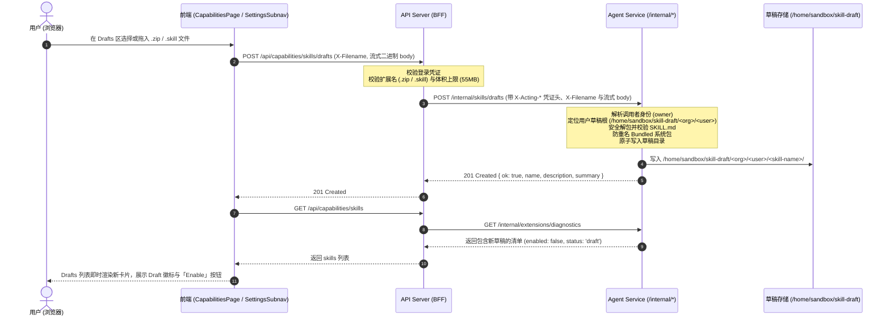

# Skill 草稿上传、Capabilities UI 优化与 Settings 二级导航设计与实施计划

本文档约束以下三项协同变更的技术设计与实施规范：
1. **Capabilities Drafts 上传 Skill 压缩包**：用户直接上传 `.zip` / `.skill` 文件，由平台解压至当前用户的草稿目录（`/home/sandbox/skill-draft/<org>/<user>/`），保持未激活（`enabled=false`），以 UI 上的「Enable」操作作为唯一发布闸门。
2. **移除 Composer 历史拼图按钮**：清理已废弃的聊天附件+预填指令链路，将 Skill 安装入口收口在 Settings → Capabilities 页面。
3. **Settings 二级导航重构与 Capabilities 页面 UI 优化**：将 `Runs` 与 `Approvals` 移至 Settings 二级菜单，提供全局 Settings 二级导航栏（Subnav）；优化 Capabilities 页面视觉、卡片状态与上传体验，并通过 Chrome DevTools 进行验证。

---

## 1. 架构定位与权威边界

依据 [AGENTS.md](file:///Users/eddie/Work/app/pi-enterprise-sandbox/AGENTS.md) §1，本次改动涉及的三层服务权威边界如下：

| 服务 | 角色 | 本次变更职责 | 严禁事项 |
|------|------|-------------|---------|
| `frontend/` | UI 状态投影 | Capabilities 页面拖拽上传、状态展示、Settings 二级导航栏、移除 Composer 拼图按钮 | 严禁直接访问执行面文件系统，严禁持有鉴权密钥 |
| `api-server/` | 薄 BFF | 会话鉴权透传（`resolveTrustedAuth`）、文件名合法性校验、请求流式转发至 Agent | 不做包解析、不判定 Run 状态、不直接操作 MySQL |
| `agent/` | 业务账本与 Skill 生命周期 | 校验并解压 ZIP/.skill 包、检查 `SKILL.md` frontmatter、安全写入草稿根、审计日志 | 上传阶段严禁自动执行 Enable，严禁写入只读已启用根 |

---

## 2. 核心数据流

---

## 3. 详细设计与代码变更点

### 3.1 Agent 服务层 (`agent/`)

1. **`agent/src/skills/install.ts`**
   - 扩充 `ARCHIVE_POLICY.upload.extensions`：将仅允许 `['.zip']` 扩展为 `['.zip', '.skill']`。
   - `installSkillArchive`：支持以 `draft_upload` 或无 `attachmentId` 形式直接向用户草稿根解压安装。
2. **`agent/src/skills/manager.ts`**
   - 新增 `installDraftArchive({ archiveBytes, archiveName })`：
     - 确保当前已绑定 `draftRoot`；
     - 校验包文件名；
     - 调用 `installSkillArchive` 将文件安全解压落入 `draftRoot`；
     - 记录审计日志：`action: 'draft_upload', source_type: 'upload'`；
     - 返回包信息 `{ name, description, summary, path }`。
3. **`agent/src/presentation/http/skill-routes.ts`**
   - 拦截 `POST /internal/skills/drafts`；
   - 提取受信身份 `authSubjectsFromRequest(req)`；
   - 检查请求头 `x-filename`；
   - 流式读取二进制 Buffer（限制在 `SKILL_ARCHIVE_MAX_BYTES = 50MB` 内）；
   - 调用注入的 `uploadSkillDraft` 函数处理，返回 201/200 JSON。
4. **`agent/src/bootstrap/http-main.ts`**
   - 组装 `uploadSkillDraft` 依赖：从 `auth` 解析 `owner`，基于 `draftSkillRootFor(owner)` 构建 `SkillManager`，调用 `installDraftArchive`。

### 3.2 BFF 代理层 (`api-server/`)

1. **`api-server/server.js`**
   - 路由分发新增：`POST /api/capabilities/skills/drafts` -> `handleSkillDraftUpload`。
2. **`api-server/src/routes/capabilities.js`**
   - 实现 `handleSkillDraftUpload(parsedUrl, res, req)`：
     - 受信鉴权 `resolveTrustedAuth(req)`；
     - 获取文件名（`x-filename`），校验扩展名是否为 `.zip` 或 `.skill`；
     - 校验 `Content-Length`（55MB 上限）；
     - 调用 `uploadAgentSkillDraft` 转发至 Agent。
3. **`api-server/src/services/agent-client.js`**
   - 实现 `uploadAgentSkillDraft(req, filename, { auth, traceId })`：以 `fetch` + `duplex: 'half'` 转发至 Agent。

### 3.3 前端 UI 与导航重构 (`frontend/`)

1. **路由与导航重构**：
   - `frontend/src/app/router/index.tsx`：新增 `/settings/runs` 与 `/settings/approvals`，保留 `/runs` 与 `/approvals` 重定向。
   - `frontend/src/app/layout/AppShell.tsx`：为所有 Settings 路径提供常驻的 `SettingsSubnav`（含 Capabilities、Approvals、Runs、A2A），保留待审批与活跃运行数徽标。
   - `frontend/src/widgets/conversation-sidebar/ConversationSidebar.tsx`：一级导航保留 Chat 与 Schedules，将 Runs 与 Approvals 收敛至 Settings。
2. **Capabilities 页面优化**：
   - `frontend/src/pages/settings/CapabilitiesPage.tsx`：
     - Drafts 区增加专属拖拽/点击上传卡片（支持 `.zip` / `.skill`）；
     - 上传期间展示 Loading Spinner；
     - 成功后触发 `refresh()`，草稿区展示带有专属 Draft 状态指示的卡片及「Enable」按钮；
     - 标签页 Chips 增加当前项目数量角标；
     - 卡片网格、元数据与排版样式优化。
   - `frontend/src/shared/styles/app.css`：
     - 添加 SettingsSubnav 样式；
     - 添加 Drafts 上传拖拽区域与进度样式；
     - 添加 `.status-draft` 琥珀色指示样式。
   - `frontend/src/shared/api/capabilities.ts`：增加 `uploadSkillDraft` API。
3. **移除 Composer 拼图按钮**：
   - `frontend/src/widgets/composer/Composer.tsx`：移除 `#btn-install-skill`、`skillFileInputRef`、`openSkillPicker()`。

---

## 4. 验证与测试规范

1. **自动化测试**：
   - `npm test --prefix agent`：执行 Agent 全部单元测试，含新增的 `skill-draft-upload.unit.test.js`。
   - `npm test --prefix api-server`：执行 BFF 单元测试，含草稿上传路由透传与鉴权校验。
   - `npm test --prefix frontend`：执行前端单元测试，更新 `capabilities-page.test.ts` 与 `a11y-responsive.test.ts`。
   - `npx tsc --noEmit -p frontend/tsconfig.json` & `npm --prefix agent run typecheck`：通过 TypeScript 类型检查。
   - `uv run pytest -q`：通过全仓布局与代码行数棘轮测试（所有生产文件 ≤1000 行）。
2. **Chrome DevTools 真机与视觉验证**：
   - 访问 `http://localhost:3000/settings/capabilities`；
   - 验证 SettingsSubnav 切换（Capabilities、Approvals、Runs、A2A）；
   - 测试拖拽/上传 `.zip` 与 `.skill` 包；
   - 检验上传前后草稿区卡片生成与 `Enable` 操作流转；
   - 使用 MCP Chrome DevTools 进行 DOM 快照与交互留存。
