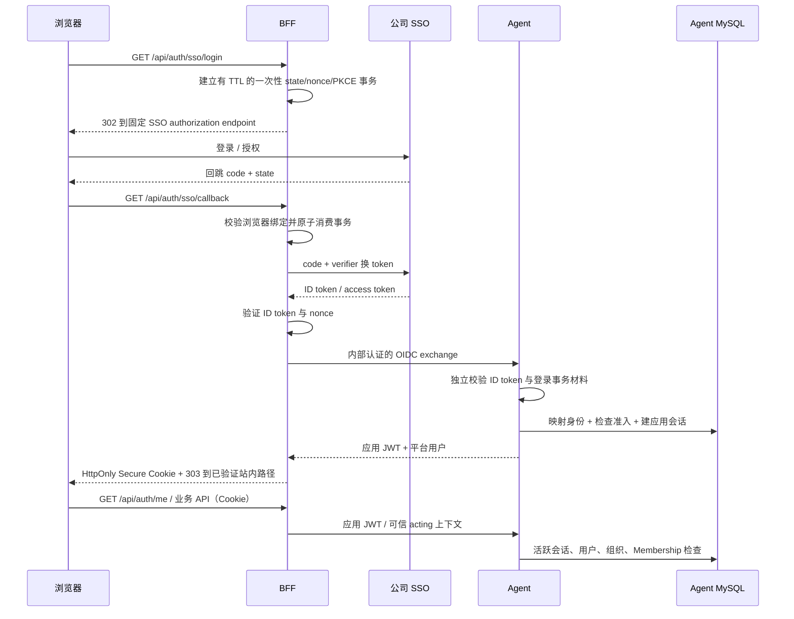

# 公司 SSO 接入预留改造方案

日期：2026-10-01。状态：**基于 main 修订；P1a/P1b 已实施并完成本轮 review，最终验收记录见文末；公司 SSO 未联调**。
静态核查基线：`5bc21550`（含 RBAC、人工审核及 UI 修复）；开始时 `main` 工作区干净。
原始草案来自 `codex/sso-reservation-plan@2d2ca298`，其核查基线早于 RBAC。
本修订以当前代码为准，任务授权范围与负责人见 §8.3；未验证的设计不描述为现有能力。

用户提供的教程声明公司 SSO 使用 OIDC / IdentityServer4，SPA 示例采用
`response_type=id_token token`，前端拿 access token 请求后端；未说明 code/PKCE 配置。
原文未注明日期，缺少引用的回调 HTML、JS 和 Postman 附件。本方案不把教程当作服务能力的实测证据。
教程和摘要存放在本机 `docs/ref/sso/`（gitignored）；本文不依赖这些本地文件即可阅读。

[`plan.md`](../plan.md) §30 将“完整企业 SSO”排除在原重构验收范围之外，允许后续演进。
本方案作为用户要求的新扩展，不修改冻结基线，也不把 SSO 方案完成计入 §32 验收完成。
本设计保留改造前的 main 基线接线，用于说明改动理由；P1 的实现与运行结果另见文末。
RBAC 已实施，SSO 复用现有角色账本，不再承担角色管理迁移。

## 1. 结论与可观察目标

建议保留“浏览器 → BFF Cookie → Agent 身份权威 → 现有资源授权”的结构，优先采用
**BFF Authorization Code + PKCE S256**。BFF 负责 OIDC 跳转和浏览器登录事务；
Agent 负责公司身份到平台账号的映射、租户准入、角色和应用会话签发/撤销。
exec、Worker、模型和 MCP 不接收公司用户 token。

接入完成时应能观察到：

- 配置关闭时，现有账号密码登录可用；未配置或校验失败时 SSO 不会变成可用入口。
- 配置启用且能力已确认时，用户跳转公司 SSO，回调成功后 `/api/auth/me` 返回平台用户，
  浏览器 JavaScript 得不到 ID/access/refresh token 或应用 JWT。
- 新身份需满足平台准入规则；无 Membership、禁用用户或禁用组织不能获得业务访问权。
- 绑定旧账号后，历史会话、文件、产物与权限仍属于同一个内部 `user_id` / `org_id`。
- 本地退出撤销新应用会话、清理浏览器状态；再次使用已撤销凭据失败。
- 合法用户可建会话、带工具执行并查进程；另一租户访问这些资源返回 404。

RFC 9700 建议优先 code，讨论了 Implicit Flow 的 token 泄漏与重放风险；
**这是推荐理由，不是公司服务支持 code/PKCE 的证明**。
[RFC 9700 §2.1](https://www.rfc-editor.org/rfc/rfc9700.html#section-2.1)。

## 2. 改造前 main 基线接线：已核对的静态事实

| 层 | 代码位置 | main@5bc21550 的行为 | 接入影响 |
|----|----------|----------|----------|
| 前端登录 | [`ConversationSidebar.tsx`](../../frontend/src/widgets/conversation-sidebar/ConversationSidebar.tsx) | 侧栏有用户名/密码登录和注册 | 预留服务端驱动的登录方式入口 |
| 前端请求 | [`client.ts`](../../frontend/src/shared/api/client.ts)、[`api.ts`](../../frontend/src/shared/schemas/api.ts) | `/api/auth/login/register/me/logout`；Cookie 携带认证，不在响应 schema 中取 token | 保持业务 API 调用方式；增加强类型登录能力 DTO |
| 前端身份边界 | [`ChatContext.tsx`](../../frontend/src/features/chat/ChatContext.tsx) | login/logout 更新身份；logout 重置流、实体与本地聊天状态；refreshAuthUser 已区分 401；初始化 me 失败仍归入未登录 | SSO 切号也要重置；区分 401 与 503，避免依赖失败被当作退出 |
| 账户页 | [`SettingsDialog.tsx`](../../frontend/src/widgets/settings/SettingsDialog.tsx)、[`account.ts`](../../frontend/src/shared/api/account.ts) | 登录方式写死“账号密码”；使用 profile 与 editable_fields | SSO 来源、只读资料、通知设置需要真实 DTO 支持 |
| BFF 入口 | [`server.ts`](../../api-server/server.ts)、[`auth.ts`](../../api-server/src/routes/auth.ts) | register/login 代理 Agent，JWT 只写 Cookie；logout 只清 Cookie | 新增 SSO 跳转/回调适配器，退出增加撤销调用 |
| Cookie | [`cookies.ts`](../../api-server/src/http/cookies.ts) | `dsh_enterprise_session`，HttpOnly、SameSite=Lax、Path=/，没有 Secure | SSO 生产入口要求 HTTPS；Cookie 策略改为显式配置且校验一致 |
| 认证转发 | [`agent-auth-client.ts`](../../api-server/src/services/agent-auth-client.ts)、[`agent-client.ts`](../../api-server/src/services/agent-client.ts) | `/internal/auth/*` 带内部 token；非流请求有超时 | 增加窄的 OIDC exchange/revoke 调用，不把 claims 直接当 acting 身份 |
| 可信身份 | [`run-access-service.ts`](../../api-server/src/application/run-access-service.ts)、[`sandbox-client.ts`](../../api-server/src/services/sandbox-client.ts) | Cookie 或 Bearer 经 Agent me；BFF 根据返回值重写 acting user/org/role，丢弃浏览器 acting 头 | 公司 access token 不直接冒充现有应用 JWT |
| Agent 登录权威 | [`http-main.ts`](../../agent/src/bootstrap/http-main.ts)、[`auth-routes.ts`](../../agent/src/presentation/http/auth-routes.ts)、[`browser-auth-service.ts`](../../agent/src/application/browser-auth-service.ts) | 本地凭据登录，Agent HS256 JWT；me 读 member_roles，用户名名单仅引导/锁定本地 admin | 拆开“平台 principal/session”与“密码凭据”；SSO 不创建假密码 |
| 角色权威 | [`member-role-service.ts`](../../agent/src/application/member-role-service.ts)、[`roles.ts`](../../agent/src/domain/identity/roles.ts) | `tbl_agsvc_member_roles` 挂在 org/user 上；`roles` 为集合，`role` 为兼容主角色 | 直接复用；不读 Membership.role 做授权，不按 SSO 用户名引导 admin |
| 平台身份与归属 | [`external-identity-resolver.ts`](../../agent/src/application/parent/external-identity-resolver.ts)、[`organization-repository.ts`](../../agent/src/infrastructure/mysql/repositories/organization-repository.ts)、[`external-reference-repository.ts`](../../agent/src/infrastructure/mysql/repositories/external-reference-repository.ts) | provider/subject 到内部 ULID；Membership 要 active | 保留内部 owner ID；公司身份单独映射 |
| 下游身份命名空间 | [`request-response.ts`](../../agent/src/presentation/http/request-response.ts) | HTTP acting 头被解析成 `provider: 'bff'` | 不能只换 token 验证器而直接透传 SSO sub |
| profile 存储 | [`auth-credential-repository.ts`](../../agent/src/infrastructure/mysql/repositories/auth-credential-repository.ts) | 显示名/邮箱在凭据和 users 双侧更新；通知开关在 users | 无密码的 SSO 用户需独立 profile 路径 |

现有用户映射是 `users.external_subject=provider:subject`，不是任意多个登录身份关联同一个
平台用户的通用表；现有 provider/subject 帮助函数会 trim，旧表多处采用
`utf8mb4_unicode_ci`。SSO 的 issuer/sub 要精确匹配，不能直接复用这些文本归一化规则。
迁移核对入口：[`core_platform_schema`](../../agent/src/infrastructure/mysql/migrations/20260718000001_core_platform_schema.js)、
[`run_authority_compatibility`](../../agent/src/infrastructure/mysql/migrations/20260718000003_run_authority_compatibility.js)。
上述是源码事实，没有通过本轮运行栈证明。
`ExternalIdentityResolver.resolveOwner` 当前只检查 Membership active；并未同时检查
user/org status。新认证 principal 的状态检查须落在权威读取路径，不能把旧 resolver 当作已具备全部准入规则。

## 3. 方案选择与公司侧前置条件

| 路径 | 适用条件 | 判断 |
|------|----------|------|
| A：BFF code + PKCE | 公司登记 confidential client，支持 code、S256 与后端换 token | 推荐；延续现有 Cookie 和薄 BFF 职责 |
| B：SPA code + PKCE 后兑换应用会话 | 公司只登记 public client，但支持 code/S256 | 备选；前端短暂处理 token，需重新评估浏览器存储与 token exchange |
| C：教程 Implicit Flow | 公司确认该 client 只能用 `id_token token` | 仅保留兼容调研方向，不自动启用；需独立说明风险和控制措施 |

B/C 都不能退化成“decode token 后把用户名/组织写入 acting 头”。必须验证 token，
绑定一次性登录事务并完成平台授权。C 若无法满足注入/泄漏防护，应推动公司侧改 client，
不以“教程这样写”作为上线理由。库名和版本在能力确认、Node 22 兼容性核验后选择，
不照抄教程里的 JS 或框架版本。

联调前要向 SSO 维护方取得以下信息；本次没有向对方发消息或申请 client：

| 问题 | 所需结果 | 影响 |
|------|----------|------|
| 环境与 issuer | 各环境精确 issuer、discovery、证书链、网络出口 | BFF 和 Agent 均需有界访问 metadata/JWKS；不得关闭 TLS 验证 |
| client | client ID、public/confidential 类型、code/S256 支持、token endpoint auth method | 决定 A/B/C；secret 仅由密钥管理注入 BFF |
| 回调 | 项目外部 HTTPS origin、精确 callback/logout URL；本地测试地址是否准入 | 不能从浏览器 Host/Forwarded 头任意拼 redirect_uri |
| token | 签名算法、ID token audience、API audience、API scope、寿命 | scope 与 audience 分开；JWKS 从 discovery 获取 |
| claims | 脱敏字段样本、sub 稳定性、sysnew/姓名/邮箱/组织 claim 名及可用 scope | 只按 `(iss, sub)` 绑定；教程没给 claim 名 |
| 准入与租户 | 接入哪些内部 org、谁可以开通、成员撤销来源 | 公司部门不能未经映射直接变成平台租户 |
| 续期与离职 | refresh/offline_access、账号禁用后的行为、最长会话时长 | 明确重新认证间隔，不能保证上游禁用立即传到本地 |
| 退出 | end_session_endpoint、是否需要 id_token_hint、是否支持 logout 通知 | 区分平台退出与公司 SSO 全局退出 |
| 旧用户 | 是否迁移已有本地账号，人工绑定/管理员核验流程 | 防止接入后产生第二个 owner 和历史数据不可见 |

教程的测试环境明确不验证密码：可检查重定向和协议接线，不能用来验收真实身份认证、
密码错误拒绝、离职停用或权限真实性。服务端直接获取 token 的额外申请功能也不并入用户登录。

## 4. 推荐流程与服务职责

以下路径和模块名均为**拟新增**。

### 4.1 BFF：OIDC client 与浏览器事务

- 以配置固定 issuer、client、外部 origin、redirect URI；metadata issuer 必须精确匹配。
  authorization/token/JWKS 端点应经过配置允许范围校验，防止动态 URL 引入 SSRF。
- 使用标准库处理 code/S256、随机 state、nonce、ID token 验证；不自写密码学。
- 事务保存 state 摘要、nonce、verifier、issuer/client、回调 URI、return_to、过期时间和
  浏览器绑定摘要。浏览器只拿临时 HttpOnly Cookie，不拿 verifier；事务短 TTL，
  原子消费，失败后重新发起登录，不重放已消费 code。
- 多副本共享事务存储，建议 BFF 专用 Redis key namespace/最小 ACL（**当前 BFF 没有该接线**）。
  Redis 只存短期登录事务，不存平台身份事实；故障关闭 SSO，不退到进程内 Map。
  控制并行登录数，多标签各自事务隔离，不用一个 Cookie 覆盖所有待回调 state。
- return_to 只允许解析后与固定外部 origin 同源的站内路径，拒绝协议相对地址、编码绕过、
  auth 回调循环；不接受浏览器指定 issuer/client/JWKS/role/org。
- callback 初版用 GET + query；若公司强制 form_post，单独验证跨站 Cookie/SameSite 接线，
  不直接修改成全站 SameSite=None。
- callback、exchange 的 query/body/响应均脱敏；包括反向代理访问日志和 tracing。
  响应 `Cache-Control: no-store`、适当 Referrer-Policy，成功/失败后跳离含 code 的 URL。
- 不把 SSO token 透传 exec、MCP 或模型，不放前端 storage；client secret 只在 BFF。

### 4.2 Agent：独立验证、平台准入与应用会话

- 新增 OIDC 身份兑换应用服务，挂在内部 token 保护的窄路由；公网回调只到 BFF。
  BFF 发起的 exchange 携带 ID token、预期 nonce 和唯一 login transaction ID；
  Agent 再验签、核对 issuer/client audience/有效期/nonce，不能只接收任意 claims JSON。
  预期 nonce 来自 BFF 已消费的事务，信任边界为既有内部认证；客户端不能访问该内部面。
- Agent 对同一 login transaction ID 的消费记录与身份绑定、会话创建同事务写入；
  重试只可在同一材料摘要下返回原结果，材料不同返回冲突，避免多次签发会话。
  不使用短期 Redis 记录作为唯一的会话签发防重放事实。
- ID token 检查算法白名单、签名、iss、aud（包含固定 client ID）、多 audience 的 azp、
  exp/iat、nonce、非空 sub；适用时检查 nbf/auth_time。若取 UserInfo，校验其 sub 与 ID token 一致。
- 只接受固定 issuer，JWKS 有限缓存、未知 kid 的有界刷新和轮换测试，网络超时、大小限制、
  限流；无法验证时拒绝，不能在刷新失败后接受未知 key。
- token 验证成功仍需平台准入。SSO 用户不经过当前 `auth_credentials` 查找和
  密码 provider 的 `ensureDeploymentGrant(username)`；准入检查 active Membership，
  授权角色读现有 `MemberRoleService.listRolesForMember(orgId,userId)` / `tbl_agsvc_member_roles`。
  `organization_memberships.role` 是成员类型，`auth_credentials.role` 是兼容投影，都不是权限权威；
  SSO claims、姓名、邮箱、同名管理员不参与授予。绑定已有本地账号保留它已有的角色集合。
- 拆出 Principal/Profile/Session 服务，使密码登录与 SSO 登录共享应用会话和用户投影，
  密码哈希只由 LocalPasswordProvider 使用。避免扩大已超行预算的装配文件，先按职责抽模块。

OIDC 验证与稳定身份依据：
[Core §3.1.3.7、§5.3、§5.7](https://openid.net/specs/openid-connect-core-1_0.html)；
metadata/JWKS 依据 [Discovery](https://openid.net/specs/openid-connect-discovery-1_0.html)。
公司的实际 token 是否满足这些条件仍需联调核验。

## 5. 身份、租户与兼容迁移

### 5.1 新增身份关联，保留已有 owner

建议新增 `tbl_agsvc_user_external_identities`（逻辑名 `user_external_identities`）：
`identity_id`、`provider_key`、精确 `issuer`、精确 `subject`、`user_id` FK、status、
创建/最近登录时间及经过最小化的资料快照。唯一身份键是 `(issuer, subject)`，
不能只用 sub 或 sysnew；provider_key 是服务端配置引用，issuer 校验仍不可省。

issuer/sub 不 trim、不改大小写、不拼进 `VARCHAR(255)` 的旧字段。DDL 要采用能精确比较的
存储/索引；在目标 MySQL 5.7 / UPDRDB 上验证长度、索引和并发约束。
若用长度分隔编码的摘要作唯一索引，保存原值并在冲突重读时精确比对，不能静默合并。

同时保留旧 `users.external_subject=bff:<平台外部用户 ID>` 与 organization_external_refs：
这是当前 HTTP → owner resolver 的兼容入口。公司身份表只关联 `user_id`，
新 SSO 用户生成平台自己的外部用户 ID 并建立 `bff` 兼容映射；
SSO me 返回这个平台 ID，**不返回原始 sub 作为 actingUserId**。
因此本阶段不增加可由浏览器控制的 `X-Acting-Provider`，也不全量替换资源表 owner。

- 已有账号绑定：管理员核验或同时完成旧账号与新 SSO 的认证后显式绑定，
  同事务检查唯一关联并记录审计；禁止按用户名/邮箱自动合并。
- 未绑定账号：默认拒绝；允许 JIT 时必须先有服务端配置的组织映射与准入名单，
  用户、外部关联、兼容映射、Membership 同一事务创建；失败整体回滚。
- 两次并发首次登录只能得到一个 user 与一套映射；冲突重读，不创建孤立 org/user。
- 公司部门仅是已验证属性；组织来源由平台映射或预开通 Membership 决定。
  不把缺失组织默认为 `org_bootstrap`，也不在下游 owner 查询时自动开通。
- 多组织用户初版由服务端固定一个已授权 Membership；没有明确规则时拒绝歧义。
  后续若加组织切换，必须校验当前用户的 active Membership，不接受任意 org_id。
- 用户、组织和 Membership 状态都要检查；跨 owner 资源保持 404。
- 绑定/解绑不改历史 `user_id`、`org_id` 和数据归属；不删除旧密码凭据和旧映射。
  停用某登录方式与禁用平台用户应是两个明确的操作。

### 5.2 可撤销应用会话与权限变化

建议新增 `tbl_agsvc_browser_auth_sessions`：session ID、user/org、登录来源、
身份关联 ID、login transaction ID/材料摘要、created/expires/revoked 时间。
Agent 签发应用 JWT，含 sid；Cookie 可继续携带该 JWT，浏览器看不到其值。
me/profile/可信身份解析检查 sid、有效期、revoked、user/org/Membership 状态；
授权角色来自当前 `member_roles`，经既有 roles 解析与 `hasRole` 判定，不以 JWT role 当权限权威。
会话表保存内部 user/org 与兼容的外部 user/org，签名 sub 和 acting 身份继续用平台外部 ID。
每次读取核对这些 ID 的映射一致性；sid 不可跨用户或组织复用，缓存不得绕过撤销和状态检查。
新 local 登录也签发 sid；本次采用切换后统一重新登录，旧无 sid JWT 返回 401，不建立永久兼容旁路。
部署顺序为 schema 发布 → Agent/Worker → BFF → frontend；回退旧消费者会恢复旧 JWT 语义，
属于安全能力退回，不能宣称已撤销的旧 token 在旧版本仍然无效。

初版不申请 offline_access、不保存 refresh token；应用会话绝对期限取平台配置与本次
ID token 剩余有效期的较小值。到期重新走 SSO 跳转，最长认证间隔由公司安全规则确认。
这是一项保守的产品策略，**并非 OIDC 要求所有本地会话必须随 ID token 同时过期**。
周期重新跳转不必然要求用户重新认证；公司全局 Cookie 可能静默签发新 token。
若公司要求认证新鲜度，需确认 max_age/auth_time 与实际停用检查语义，再由双侧验证实施。
没有可验证的上游停用策略/logout 通知时，不能声称账号禁用即时撤销或给出传播时间上限。

退出调用 Agent 撤销 sid，再清 Cookie；即使上游 logout 不可达，已完成的本地撤销仍有效。
退出契约：有效 sid 成功撤销返回 200 `{ok:true, revocation:"confirmed"}`；
缺失/已过期/已撤销凭据幂等返回 200 `{ok:true, revocation:"not_required"}`。
无效签名不作数据库写入。签名合法但缺 sid 的旧凭据按普通无效会话处理，
返回 401 `INVALID_TOKEN`（BFF 映射为 `not_required`），仅清 Cookie，要求重新登录，
不声称撤销已完成。旧 409 `LEGACY_SESSION_NOT_REVOCABLE` 分支已删除。
DB 故障或调用超时返回 503 `AUTH_REVOCATION_UNCONFIRMED`；BFF 仍清 Cookie，
前端清理本机身份与旧流并显示“本机已退出，服务端会话撤销未确认”。
因响应丢失无法确定 Cookie 是否已清时，前端也必须完成本机清理并提示未确认；
不得保留旧用户数据，不自动拿可能属于新账号的当前 Cookie 重试撤销。
后续后台重试需要仅关联原 sid 的可信机制；初版不声称本机清理能替代服务端撤销。
撤销后阻止新请求；对已经打开的 SSE，应设计有界重新授权/关流，浏览器切号时立即断流，
并验证不继续向新用户呈现旧账号数据。退出是否取消已运行任务应保持现有产品语义并明确记录。

全局退出作为单独能力；只有确认 end_session_endpoint、所需 hint 和已登记回跳 URI
后才启用。若必须保存 id_token_hint，服务端加密短期保存，不回传前端。
[RP-Initiated Logout](https://openid.net/specs/openid-connect-rpinitiated-1_0.html)。
服务端续期、refresh token 轮换、back-channel logout 另设后续阶段，不在初版假设已具备。

### 5.3 本地登录与资料兼容

采用 `local | sso | hybrid` 部署模式（拟新增），预留阶段默认 local。sso 模式下不仅隐藏
密码 UI，还要在服务端关闭公开密码 login/register；hybrid 显式开放两者，SSO 故障不能
静默切到 AUTH_ENABLED=false。本次 sid 迁移选择统一重新认证，
不是通过旧凭据自动换新会话；未来 sso-only 切换也须明确失效所有 local 来源会话。

SSO profile 增加 login_method/identity_provider，并由 Agent 返回 editable_fields。
默认姓名和公司邮箱由 SSO 管理、只读；通知开关仍属平台用户，没邮箱时不能启用发信。
缺 email claim 不自动填假邮箱或额外申请 email scope。旧密码用户保持已有字段编辑行为。
当前前端 schema 要求 username 为字符串；SSO 投影应提供非空值，使用已确认的 sysnew claim，缺失时返回
平台生成的稳定账号标识并用 display_name 展示姓名，不能让缺 claim 导致登录后解析失败。
这些资料字段不参与唯一身份或权限匹配。
RBAC 已在 main 实施（见 [rbac-roles.md](rbac-roles.md)）：无需在 SSO 重做迁移。
当前用户名名单只用于本地密码凭据引导/锁定；SSO 绝不能复用它授予新身份 admin。
绑定已有用户直接复用该用户的 org/user 角色，不新增按公司用户名匹配的授权通道。

## 6. 拟定 API 与错误契约

| 接口（拟新增/扩展） | 契约与鉴权 |
|--------------------|------------|
| `GET /api/auth/config` | 未登录可读；返回有效登录方式和可用状态，不返回 secret/token/JWKS 内容；加载失败显示错误并可重试，不能当成空方式列表 |
| `GET /api/auth/sso/login?return_to=...` | 创建浏览器绑定事务后 302；限流；仅服务器配置的公司 provider |
| `GET /api/auth/sso/callback` | 验证 state/绑定/TTL/code，exchange 后写 Cookie、303 到安全站内路径；失败跳到站内错误页，只带稳定错误码 |
| `POST /internal/auth/oidc/exchange` | 内部 token + 有界请求体；ID token/nonce/transaction ID；输出 `{token,user}` 仅给 BFF；错误无原始 claims/token |
| `POST /internal/auth/logout` | 内部 token + 应用 JWT，撤销当前 sid；重复退出幂等 |
| `GET /api/auth/me` | 保持现有 id/username/display_name/organization_id/roles/role，增加 login_method/identity_provider；不返回公司 token |
| `GET/PATCH /api/auth/profile` | 当前应用会话；校验 editable_fields，SSO 管理字段明确拒绝，不静默丢弃 |
| `POST /api/auth/logout` | 按 §5.2 返回确认/无需撤销/未确认；所有结果清 Cookie；全局退出另设能力 |

config 建议形状为 `{mode, methods: {local: {enabled, registration_enabled},
sso: {enabled, available, label}}, profile_policy}`。profile_policy 仅表示默认策略；个人资料以 profile.editable_fields 为准。enabled 表示配置意图，available 表示
经过必要配置/能力校验可发起登录；disabled 的 sso.available 必须 false。
部署时 schema 与前端类型同时落地，字段未知/模式非法必须诊断。

| HTTP / 错误码（拟定） | 语义 |
|----------------------|------|
| 400 `SSO_STATE_INVALID` / `SSO_CALLBACK_INVALID` | 事务缺失、过期、绑定失败、重放或回调参数非法 |
| 401 `SSO_TOKEN_INVALID` / `INVALID_TOKEN`（含无 sid 旧凭据；退出面映射为 `not_required`） | 上游 token 不合法，或应用会话无效/过期/已撤销 |
| 403 `SSO_ACCESS_DENIED` | 上游明确拒绝用户授权；不泄漏本地资源存在性 |
| 404 `SSO_ACCESS_UNAVAILABLE` | 身份未获平台准入、无有效归属；通用提示，不回传其他租户信息 |
| 409 `IDENTITY_BINDING_CONFLICT` | 需要本人/管理员处理的绑定冲突，不泄漏另一个账号内容 |
| 422 `PROFILE_FIELD_NOT_EDITABLE` | 用户修改受 SSO 管理的资料字段 |
| 503 `AUTH_REVOCATION_UNCONFIRMED` | 撤销 DB 失败/超时；Cookie 和本机状态已清，原凭据失效尚未确认 |
| 503 `SSO_CONFIG_UNAVAILABLE` / `SSO_UPSTREAM_UNAVAILABLE` / `AUTH_STORE_UNAVAILABLE` | 配置、公司依赖或权威存储不可用；拒绝认证，不记成匿名成功 |

callback 从未登录浏览器可达，但不是免校验入口。当前 `/api/auth/*` 在 BFF 的公共路径
判定中整体放行，新 handler 必须分别落实事务或会话要求。
Cookie 写请求（退出、profile、绑定等）补全 CSRF 防护：Origin/Fetch Metadata 与必要的
CSRF token，登录回调用独立 state/nonce/PKCE 规则；CORS 响应头不能替代服务端防护。
API Bearer 使用者继续用平台 JWT；公司 access token 作为直接 API 凭据不是本阶段能力。

## 7. 配置与部署预留

下列是提议的配置契约，**当前无消费者，不在本轮写入 `.env.example` 或部署清单**。
实施时环境变量、配置解析、Compose/K8s 注入、实际消费者和文档必须一起接通。

| 拟定字段 | 消费者 | 规则 |
|----------|--------|------|
| `AUTH_LOGIN_MODE` | Agent 策略；BFF 投影 | local/sso/hybrid，缺省 local；sso/hybrid 配置不全明确关闭或拒绝部署 |
| `SSO_ISSUER` / `SSO_CLIENT_ID` | BFF OIDC client、Agent verifier | 双侧固定一致；issuer 与 discovery 精确匹配 |
| `SSO_CLIENT_SECRET` / `SSO_TOKEN_AUTH_METHOD` | 仅 BFF | 按 client 登记方式要求；secret 来自密钥管理，不进 Vite env |
| `SSO_SCOPES` | BFF | 初版 openid/profile，附加 scope 依实际需求申请；不当作 audience |
| `SSO_REQUEST_TIMEOUT_MS` | BFF 与 Agent 的出站读取 | 正整数，上限明确；token exchange 不做无界重试 |
| `SSO_TRANSACTION_TTL_SECONDS` | BFF 事务存储 | 短期限、并发登录上限、独立 key namespace |
| BFF 登录事务 Redis 连接配置 | BFF | 最小 ACL、secret 注入、启动校验；具体名在存储选型后锁定 |
| `SSO_ADMISSION_POLICY` / 固定 org 映射 | Agent | 默认 preprovisioned；JIT 必须显式 allowlist；版本化、未知字段拒绝 |
| `AUTH_SESSION_TTL_SECONDS` | Agent 应用会话服务 | 会话期限与重新认证策略；现有 SANDBOX_JWT_* 兼容需有迁移说明 |
| `AUTH_PUBLIC_ORIGIN` / `AUTH_COOKIE_SECURE` | BFF | 生产 SSO 强制 HTTPS + Secure；回调 URI由固定 origin 推导；代理头只来自受信入口 |

若需要直接验证 API access token，再单独增加 API audience/scopes，不把它们混入 client
ID 或初版 ID token 认证配置。生产与测试使用不同 client/issuer/事务 key namespace。
当前 Cookie 不带 Secure，因此“只加一个 SSO 按钮”不满足生产接入目标。

## 8. 可审查的实施阶段

| 阶段 | 改动所有权与内容 | 验收/进入下一阶段的条件 |
|------|------------------|-----------------------|
| P0：资料与能力确认 | 公司接入申请、脱敏 discovery/claims、部署 origin、准入/迁移政策 | code/S256/client/network/HTTPS 已确认；否则只推进与协议无关的 P1 |
| P1a：principal 与会话底座 | 独立 session/JWT 模块、真实 session 表及 schema manifest；local 签 sid；检查 active principal，复用 member_roles，logout/revoke | local 正反路径与真实数据库通过；角色撤销仍下一请求生效；旧无 sid JWT 拒绝，注销凭据重放失败 |
| P1b：预留投影与浏览器边界 | Agent config DTO，BFF 代理与退出失败契约；前端动态登录方式、401/503 区分、身份代次清理、profile 来源 | SSO unavailable 无可用假入口；config/me 失败可重试；切号/退出清理旧实体，资料与草稿回归通过 |
| P2：外部身份关联 | 新 identity 表与原子绑定/JIT/登录交换账本；稳定 bff owner | 真实唯一约束、并发、回滚、旧 owner 访问与显式准入通过；不在未确认 P0 时开放 JIT |
| P3：OIDC 适配 | BFF transaction store、code callback；Agent verifier/exchange；HTTPS/Cookie/CSRF | 可控真实 OIDC 服务的正反链路通过，再以公司环境联调；只在能力确认后启用 |
| P4：浏览器与上线验收 | 登录/失败/重试、账户页来源、SSO-only/hybrid、撤销、日志脱敏、文档同步 | 公司认证验收、完整业务链、跨租户 404、多副本回调和回退演练通过 |

各阶段都不能靠 fake provider 或手工注入 repository 完成接线验收。若后续多人实施，
先分配 frontend/BFF/Agent 文件所有权；容器重建与共享数据库迁移由单一负责人操作，
接口 DTO 和错误码先锁定后并行。本轮不启动分工或代码实施。

建议文件落点（P1 的实际落点见交接与验收记录，P2–P4 待实施）：

| 包 | 新模块/现有接入点 | 职责 |
|----|------------------|------|
| BFF | `src/routes/sso.ts`、`src/services/oidc-client.ts`、`src/services/login-transaction-store.ts` | 跳转/回调、标准 OIDC client、共享短期事务；`server.ts` 只挂路由 |
| Agent application | `principal-service.ts`、`browser-session-service.ts`、`oidc-login-service.ts` | 平台投影/准入、应用会话、身份兑换；本地密码提供器独立，不把 OIDC 分支全部塞进 BrowserAuthService |
| Agent infrastructure | `oidc/id-token-verifier.ts`、`mysql/repositories/user-external-identity-repository.ts`、`browser-auth-session-repository.ts` | 外部协议验证与权威身份/会话事务；DDL 使用新的迁移编号 |
| Agent HTTP/bootstrap | `auth-routes.ts` 与独立的认证装配模块 | 接入 exchange/revoke/config，保留内部 auth gate；避免增加热点文件预算 |
| frontend | `shared/api/auth.ts`、`shared/schemas/auth.ts`、侧栏/账户页/ChatContext | 登录能力与错误 DTO、跳转、身份代次重置、资料来源投影 |

预留的关键接口是 `LoginTransactionStore.create/consume`、
`OidcClient.start/complete`、`OidcIdentityVerifier.verify`、
`PrincipalService.resolveActive`、`BrowserSessionService.issue/resolve/revoke`。
它们只隔离职责，不构建对外 SDK；生产工厂接线与运行验证需要同时覆盖。

### 8.1 验证矩阵

- local / disabled：现有登录、注册策略、me/profile、退出、Cookie/Bearer 对照；
  不因 SSO 配置失败关闭鉴权；合法请求成功与未登录请求拒绝都覆盖。
- OIDC：正常登录对照；错误 state/nonce/issuer/aud/azp、过期/错误签名/未知 kid、
  JWKS 轮换与不可达、code 重放、callback 注入、上游拒绝、超时都 fail-closed。
- 事务与多副本：start 与 callback 落不同 BFF，重启、双标签、多次点击、并发 exchange；
  只创建一个 identity/user/session，失败不遗留半套身份；Redis 故障不降级。
- 身份：不同 issuer 的相同 sub、大小写不同 sub、同邮箱不同 sub、缺 org、
  绑定冲突、禁用 user/org/Membership；无 admin 自动提升，历史 owner 正向访问成功。
- Cookie/浏览器：HTTPS 下 Secure；回调不泄 token；跨站 mutation 被拒；
  config/me 503 可重试，401 才进入重新认证；草稿与并发响应遵循身份代次隔离。
  SSO 字段编辑拒绝、合法通知开关保存成功、退出/切号丢弃旧流和旧实体。
- 撤销：退出后重放应用 JWT 失败；本地退出与 SSO 全局退出分开验证，
  DB 故障不报告撤销成功；已有 SSE 有界停止，明确上游停用传播时间上限。
- 真实业务：登录 → 建会话 → 一轮带工具 run → logs/signal → 跨租户 404；
  SSE、上传、下载、审批走原平台权限，不把 SSO token 下发执行面。

优先扩展现有回归入口：[`browser-auth.unit.test.ts`](../../agent/tests/http/browser-auth.unit.test.ts)、
[`auth-config.test.js`](../../api-server/tests/auth-config.test.js)、
[`cookies.test.js`](../../api-server/tests/cookies.test.js)、
[`t4-authority-headers.unit.test.js`](../../api-server/tests/t4-authority-headers.unit.test.js)、
[`auth-profile-proxy.test.js`](../../api-server/tests/auth-profile-proxy.test.js)、
[`account-draft.test.ts`](../../frontend/test/account-draft.test.ts)。新 OIDC/identity/session 测试按职责独立建文件。

代码阶段先相关回归和类型检查；最终按 [`AGENTS.md`](../../AGENTS.md) §4 跑六套测试、
全部类型检查、frontend build、Compose 校验，重建并更新消费者，再做浏览器和真实业务链。
外部替身只证明协议接线，不代替公司 issuer、真实 claims、停用和登记权限验证。

### 8.2 文档与回退

实现时同 PR 更新 api、architecture、deployment、development、webui、CHANGELOG；
新增配置同步 `.env.example`，新路由同步 api。新增 DDL 走现有 schema release 流程，
不改写已发布迁移。落定与基线兼容的架构决策后再增 ADR，先检查编号是否占用。
涉及现有 §32 状态变化才更新 STATUS、追加 PROCESS_LOG；不得凭 SSO 单测关闭旧验收缺口。

上线回退优先恢复经过验证的 local/hybrid 配置并撤销 SSO 来源应用会话，
由运营确认本地账号仍有合法登录方式；**不得关闭 AUTH_ENABLED**。
身份关联表/旧映射保留，先停用新功能再回退消费者；含线上数据的新表不得直接 drop。

### 8.3 本轮交接与范围

本轮实施 P1a/P1b：协议无关的可撤销本地会话与预留投影。先接真实 session 账本，
再接 config/退出契约和浏览器边界，避免先抽空 session 接口却没有权威存储。
身份关联与 OIDC 留到 P2/P3；不新增未实现字段，不启用公司的未确认能力。
具体 DTO、文件所有权、验证负责人和成功/失败对照见
[sso-reservation-tasks.md](sso-reservation-tasks.md)。该交接是实施范围，后续阶段仍是设计。

## 9. 本次设计核查与证据边界

2026-10-01 在 main@5bc21550 静态追踪：前端登录/boot/退出 → BFF auth 代理与
resolveTrustedAuth → BrowserAuthService → MemberRoleService、凭据及组织仓储。
确认角色账本已实施、旧 logout 仅清 Cookie、JWT 没有 sid、boot 的 503 仍归入未登录。
这些是代码观察，不是本轮运行认证或公司联调的证据。

官方 OAuth/OIDC Core、RFC 9700、RP-Initiated Logout 原文重新核对；仅用来约束协议设计，
不推断公司服务的实际能力。仓库 Node/Python 版本以 runtime-versions.json 为准。
P1 本轮 review 见 [review 报告](../reviews/2026-10-01-sso-reservation/README.md)，
命令、镜像/容器更新、真实数据库、浏览器与验收限制见
[验证记录](../evidence/2026-10-01-sso-reservation-p1.md)。
公司 OIDC 的 client、issuer、claims、code/PKCE、停用传播和全局退出仍未验证。

P1 review 补充契约：BFF 到 Agent 的连接失败、超时或成功响应 JSON 无法解析统一为
`503 AUTH_DEPENDENCY_UNAVAILABLE`（login/register/me/profile）；config 保留
`AUTH_CONFIG_UNAVAILABLE`，logout 保留 `AUTH_REVOCATION_UNCONFIRMED`。
明确的上游 400/401/403/409/422 与 `AUTH_STORE_UNAVAILABLE` 保留原语义。
