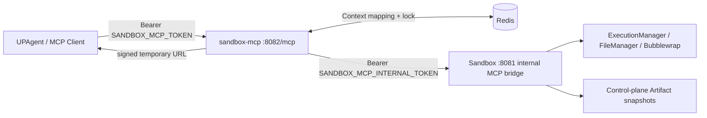

# 独立部署的 Sandbox MCP

`sandbox-mcp` 是与 `sandbox` 同仓库、同镜像但不同进程的 Streamable HTTP
MCP 服务。它不依赖 Agent Runtime，也不挂载 workspace、tmp 或 Artifact
目录；所有有状态操作都只经 Sandbox 的私有 `/internal/mcp/v1/*` 桥接完成。



## 能力与状态

| MCP Tool | 作用 |
|---|---|
| `sandbox_python_execute` | 在隔离 Python 环境执行代码 |
| `sandbox_file_write` | 写入 UTF-8 文件（覆盖或追加） |
| `sandbox_file_read` | 读取文本文件（可传 offset/limit） |
| `sandbox_file_list` | 有深度上限的文件列表 |
| `sandbox_artifact_submit` | 对已生成文件做不可变快照并返回临时下载 URL |

每个调用可传 `context_id`。`sandbox-mcp` 把它映射为 Redis 中的
`(sandbox_session_id, workspace_id)`，首次使用会在短锁下创建工作区；同一
`context_id` 的后续调用复用该工作区。未传 `context_id` 时会返回生成的 ID，
调用方应保存它以继续同一工作区。

执行输出和小型文本直接作为工具结果返回。文件不穿过 Agent，也不会把
Sandbox 卷挂给 MCP 进程：`sandbox_artifact_submit` 把文件快照到 Sandbox
控制面，下载由 `sandbox-mcp` 用签名 URL 代理。Redis 元数据和签名同时过期；
Sandbox 会在后续提交时清理超过保留期的快照。

## 部署

开发 Compose 会启动 `sandbox-mcp`，并通过开发入口网络只在 loopback 发布 `8082`：

```sh
docker compose up -d redis sandbox sandbox-mcp
```

MCP endpoint 是 `http://127.0.0.1:8082/mcp`，请求带：

```http
Authorization: Bearer <SANDBOX_MCP_TOKEN>
```

生产 overlay 会移除端口发布。将一个带 TLS 的受控入口反向代理到
`sandbox-mcp:8082`，并把该公网地址设置为
`SANDBOX_MCP_PUBLIC_BASE_URL`；Artifact URL 才会对外可下载。MCP 的 DNS
rebinding 保护只接受 loopback、服务名，以及这个配置的公共 host。

必须分别设置以下高熵值，严禁复用 `SANDBOX_API_TOKEN`、Agent HMAC key 或
Sandbox replay Redis 密码：

- `SANDBOX_MCP_TOKEN`：MCP 客户端到 `sandbox-mcp`
- `SANDBOX_MCP_INTERNAL_TOKEN`：`sandbox-mcp` 到 Sandbox 私有桥
- `SANDBOX_MCP_DOWNLOAD_SECRET`：Artifact 下载 URL 签名

`SANDBOX_MCP_REDIS_URL` 使用服务 Redis 的专用 key 前缀
`sandbox:mcp:v1`，不得指向仅供 HMAC 重放保护的
`sandbox-replay-redis`。
