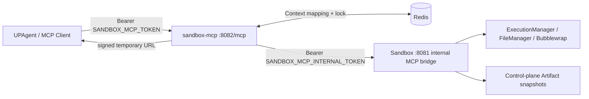

# 独立部署的 Sandbox MCP

`sandbox-mcp` 是与 `sandbox` 同仓库、同镜像但不同进程的 Streamable HTTP
MCP 服务。它不依赖 Agent Runtime，也不挂载 workspace、tmp 或 Artifact
目录；所有有状态操作都只经 Sandbox 的私有 `/internal/mcp/v1/*` 桥接完成。



## 能力与状态

| MCP Tool | 作用 |
|---|---|
| `sandbox_python_execute` | 在隔离 Python 环境执行代码 |
| `sandbox_file_write` | 写入 UTF-8 文件（覆盖或追加） |
| `sandbox_file_read` | 读取文本文件（可传 offset/limit） |
| `sandbox_file_list` | 有深度上限的文件列表 |
| `sandbox_artifact_submit` | 对已生成文件做不可变快照并返回临时下载 URL |

每个调用可传 `context_id`。`sandbox-mcp` 把它映射为 Redis 中的
`(sandbox_session_id, workspace_id)`，首次使用会在短锁下创建工作区；同一
`context_id` 的后续调用复用该工作区。未传 `context_id` 时会返回生成的 ID，
调用方应保存它以继续同一工作区。

### 低代码平台（Dify 等）会话绑定

推荐在**会话开启时**生成一个稳定的 `context_id`（格式
`^[A-Za-z0-9][A-Za-z0-9._:-]{0,254}$`，例如会话 UUID 或 `conv_<id>`），并在
**每一次** sandbox tool 调用中注入同一值（含
`sandbox_artifact_submit`）。不要依赖模型记忆返回值。

常见失败（以前会显示模糊的 “Sandbox rejected the request” / 内部错误）：

| 现象 | 真实原因 |
|---|---|
| write 成功但 artifact 失败 | 两次调用的 `context_id` 不一致，或 submit 时漏传 → 新空工作区 |
| `FILE_NOT_FOUND` | `source_path` 不是该 workspace 内已有相对路径（不要传绝对路径） |
| `TOO_LARGE` | 文件超过 `SANDBOX_MCP_MAX_FILE_SIZE_BYTES`（默认 10MiB） |
| `Invalid context_id` | ID 含空格、中文、`/` 等非法字符，或超过 255 字符 |

`sandbox_artifact_submit` 只是把 workspace 里**已有文件**做不可变快照；
不会从低代码平台上传二进制。生成文件请先
`sandbox_python_execute` / `sandbox_file_write`，再 submit。

### Artifact 下载 URL

submit 成功后返回的 `download_url` 用 query `token` 鉴权（**不需要** Bearer）。
点击该 URL 应返回文件字节。

若返回 **HTTP 500** 且文件名含中文/非 ASCII：旧版把原名直接写入
`Content-Disposition: filename="..."`，Starlette 按 latin-1 编码 header 会
`UnicodeEncodeError`。请升级包含 RFC 5987 `filename*` 修复的版本。

返回 **404 Artifact not found**：token 无效/过期，或 Redis 元数据已过期
（`SANDBOX_MCP_ARTIFACT_TTL_SECONDS`，默认 24h）。

注意 submit 响应里的 `context_id` 以服务端回显为准；若与平台注入值不同，
说明该次调用未带上你期望的 `context_id`（服务端自动生成了新的）。

执行输出和小型文本直接作为工具结果返回。文件不穿过 Agent，也不会把
Sandbox 卷挂给 MCP 进程：`sandbox_artifact_submit` 把文件快照到 Sandbox
控制面，下载由 `sandbox-mcp` 用签名 URL 代理。Redis 元数据和签名同时过期；
Sandbox 会在后续提交时清理超过保留期的快照。

## 部署

开发 Compose 会启动 `sandbox-mcp`，并通过开发入口网络只在 loopback 发布 `8082`：

```sh
docker compose up -d redis sandbox sandbox-mcp
```

MCP endpoint 是 **`http://127.0.0.1:8082/mcp`**（路径必须包含 `/mcp`），请求带：

```http
Authorization: Bearer <SANDBOX_MCP_TOKEN>
```

常见误配：把客户端地址写成 `http://ip:8082/` 或 `http://ip:8082`。服务根路径
不是 MCP 协议入口，会返回 404，并提示改用 `/mcp`。日志里的 `POST / not found`
通常就是这个原因。

内网其它机器访问时还需：

1. 发布绑定：`.env` 设 `SANDBOX_MCP_HOST_BIND=0.0.0.0`（默认仅 `127.0.0.1`）
2. 公网/内网可达 URL：`SANDBOX_MCP_PUBLIC_BASE_URL=http://<ip>:8082`（含 DNS-rebinding 允许的 Host）
3. 客户端完整 URL：`http://<ip>:8082/mcp` + Bearer token

生产 overlay 会移除端口发布。将一个带 TLS 的受控入口反向代理到
`sandbox-mcp:8082`，并把该公网地址设置为
`SANDBOX_MCP_PUBLIC_BASE_URL`；Artifact URL 才会对外可下载。MCP 的 DNS
rebinding 保护只接受 loopback、服务名，以及这个配置的公共 host。

必须分别设置以下高熵值，严禁复用 `SANDBOX_API_TOKEN`、Agent HMAC key 或
Sandbox replay Redis 密码：

- `SANDBOX_MCP_TOKEN`：MCP 客户端到 `sandbox-mcp`
- `SANDBOX_MCP_INTERNAL_TOKEN`：`sandbox-mcp` 到 Sandbox 私有桥
- `SANDBOX_MCP_DOWNLOAD_SECRET`：Artifact 下载 URL 签名

`SANDBOX_MCP_REDIS_URL` 使用服务 Redis 的专用 key 前缀
`sandbox:mcp:v1`，不得指向仅供 HMAC 重放保护的
`sandbox-replay-redis`。
